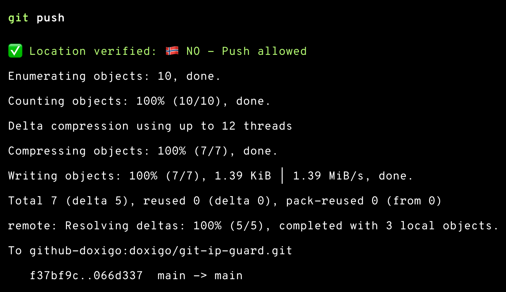
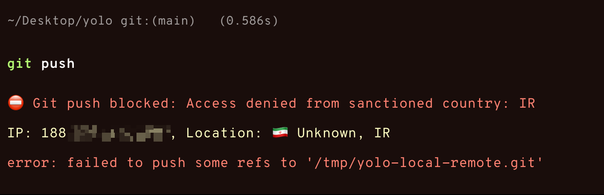

# Git IP Guard

A security tool that prevents git pushes from sanctioned countries and provides visual indicators in your terminal.

## Context

There have been a lot of issues for developers living in sanctioned countries, which is quite unfortunate since they don't really have anything to do with the political side of things.

Git IP Guard - a tool that enforces location-based restrictions on git pushes. While it's important to comply with regulations, it's equally important to remember that behind every blocked push is a developer trying to contribute to open source, learn, or simply do their job.

The tool includes bypass mechanisms because sometimes compliance requirements conflict with humanitarian considerations. It's transparent about what it's doing (showing your location with country flags) and provides clear options for exceptions.

This isn't a celebration of restrictions, but rather a technical implementation of an unfortunate reality. I hope for a future where such tools become unnecessary and all developers can contribute freely regardless of their geography.

## Screenshots

### ✅ Push Allowed


### ⛔ Push Blocked


## Features

- 🛡️ Blocks git push operations from sanctioned countries
- 📍 Automatic IP location detection with country flag display
- 🎨 Color-coded terminal prompts with clear feedback
- 🌍 Shows country flags for visual location confirmation (🇳🇴 🇺🇸 🇬🇧 etc.)
- 🔧 Easy installation and uninstallation
- 📦 Works with both new and existing repositories
- 🧪 Comprehensive test suite for all features

## Requirements

- macOS with Homebrew
- Git
- Bash/Zsh shell
- `jq` (JSON processor)
- `curl` (for IP detection)

## Installation

### Quick Start

1. Clone this repository:
   ```bash
   git clone https://github.com/yourusername/git-ip-guard.git
   cd git-ip-guard
   ```

2. Install jq if not already installed:
   ```bash
   brew install jq
   ```

3. Run the installation script:
   ```bash
   chmod +x install.sh
   ./install.sh
   ```

4. For existing repositories, you have two options:
   
   **Option A**: Apply to individual repos
   ```bash
   cd /path/to/your/repo
   git init
   ```
   
   **Option B**: Bulk apply to multiple repos
   ```bash
   # Interactive mode - will prompt before overwriting existing hooks
   ./apply-to-existing-repos.sh
   
   # Force update mode - automatically overwrites existing hooks
   ./apply-to-existing-repos.sh --force
   ```

### Installation Options

```bash
# Basic installation (git hooks only)
./install.sh

# Install with system-wide helper (requires sudo)
./install.sh --install-helper
```


## Uninstallation

To completely remove Git IP Guard:

```bash
chmod +x uninstall.sh
./uninstall.sh

```

## Usage

Once installed:

1. When you run `git push`, the system checks your IP location on-demand
2. Git pushes will be blocked if you're in a sanctioned country
3. The hook displays your location with country flag for transparency

### Testing

To test the blocking functionality without needing a real remote:

```bash
./test-push.sh
```

To manually test with different locations:
1. Switch to a VPN location (try a sanctioned country like Russia)
2. Run the test script again

## Sanctioned Countries/Regions

Git pushes are blocked from:
- 🇧🇾 Belarus (BY)
- 🇨🇺 Cuba (CU)
- 🇮🇷 Iran (IR)
- 🇰🇵 North Korea (KP)
- 🇷🇺 Russia (RU)
- 🇸🇾 Syria (SY)
- 🇺🇦 Specific regions of Ukraine:
  - Crimea
  - Donetsk Oblast
  - Luhansk Oblast

## Testing

Run the comprehensive test suite:

```bash
./test.sh          # Run all tests
./test.sh current  # Test current location only
./test.sh bypass   # Test bypass mechanisms
./test.sh helper   # Test git-ip-check helper
```

The test will show:
- Your current location with country flag
- Whether pushes are allowed or blocked
- Verification of all bypass methods

## How It Works

1. When you run `git push`, the pre-push hook checks your IP location
2. Uses `ifconfig.co` as primary service (more reliable, provides ISO country codes)
3. Automatically falls back to `ipinfo.io` if primary service is unavailable
4. Verifies if your country is in the sanctioned list
5. If not sanctioned, the push proceeds normally with country flag display
6. If sanctioned, the push is rejected with clear error message and location info
7. Special handling for Ukraine to check specific regions
8. Fails securely - blocks push if location cannot be determined

## Disabling/Bypassing IP Checks

There are three ways to disable or bypass the IP check mechanism:

### 1. Temporary Bypass (Single Command)

For a one-time bypass, set the `SKIP_IP_CHECK` environment variable:

```bash
SKIP_IP_CHECK=1 git push origin main
```

This is useful when you need to push urgently or are experiencing false positives.

### 2. Repository-Specific Disable

To disable IP checks for a specific repository:

```bash
cd /path/to/your/repo
git config hooks.allowpush true
```

To re-enable:

```bash
git config --unset hooks.allowpush
```

### 3. Global Disable

To completely disable Git IP Guard globally:

```bash
# Remove the git template directory setting
git config --global --unset init.templateDir

# Delete the hook from the template directory
rm ~/.git-templates/hooks/pre-push

# For existing repositories, you'll need to manually remove the hook
# rm .git/hooks/pre-push
```

Note: After global disable, new repositories won't have the IP check, but existing repositories will still have the hook unless manually removed.

## Troubleshooting

### "IP cache file not found" error

If you see this error after updating Git IP Guard:
- You have an outdated `git-ip-check` helper installed
- Solution: Update the helper with `sudo ./install.sh --install-helper`
- Alternative: Remove it with `sudo rm /usr/local/bin/git-ip-check`

### Connection or IP detection errors

- Check your internet connection
- Try the push again (the hook includes automatic retry logic)
- Use `SKIP_IP_CHECK=1 git push` if you need to bypass temporarily


### Hook not triggering

- For new repos: The hook is automatically installed via git templates
- For existing repos: Run `git init` in the repository to apply the template
- **Important**: Both `pre-push` and `ip-check-config.json` must be present in `.git/hooks/`
- If `ip-check-config.json` is missing, use `./apply-to-existing-repos.sh --force` instead of `git init`

### False positives with VPN

If you're using a VPN, the detected country will be the VPN server's location, not your actual location. You can use the temporary bypass method described above.

## Security Considerations

- This is a client-side check and can be bypassed by modifying the hook
- For server-side enforcement, implement similar checks in your Git server
- The hook uses ifconfig.co as primary service with automatic fallback to ipinfo.io
- IP detection services have rate limits for free usage, but the helper includes retry logic
- **Important**: The system fails securely - if IP location cannot be determined (e.g., due to service blocking certain countries), the push is blocked for security reasons
- The system shows country flags and location details for better user feedback

## Contributing

Pull requests are welcome! Please feel free to submit improvements.

## Advanced Features

### Rate Limit Handling

The git-ip-check helper includes automatic fallback to alternative IP services:
1. Primary: `ifconfig.co/json` (provides ISO country codes, more reliable)
2. Fallback: `ipinfo.io/json` (automatic switch when primary is unavailable)
3. Retry logic with delays
4. Country flag display for visual feedback (🇳🇴, 🇺🇸, 🇬🇧, etc.)
5. Handles both ISO codes and full country names

This ensures the IP check continues working even during rate limiting.

### Reusable Helper Script

The `git-ip-check` script can be installed system-wide for use in multiple hooks:

```bash
# Install to /usr/local/bin (requires sudo)
./install.sh --install-helper

# Use in any git hook
git-ip-check "/path/to/config.json"

# With custom bypass variables
git-ip-check "/path/to/config.json" MY_BYPASS_VAR my.config.key
```

### Using in Other Hooks

Example pre-commit hook:
```bash
#!/bin/bash
git-ip-check "$(dirname "$0")/ip-check-config.json" \
  "COMMIT_IPCHECK_BYPASS" \
  "ipcheck.disable.commit"
```

This allows you to:
- Use different bypass mechanisms for different hooks
- Share the same IP checking logic across multiple git operations
- Maintain consistent security policies

### Bulk Apply to Existing Repositories

The `apply-to-existing-repos.sh` script helps you apply Git IP Guard to multiple existing repositories:

**Interactive mode** (recommended):
```bash
./apply-to-existing-repos.sh
```

This will prompt you to:
1. Search common development directories
2. Search from current directory
3. Specify a custom directory

**Command line mode**:
```bash
# Apply to specific directories
./apply-to-existing-repos.sh ~/Projects ~/Work

# Apply to all repos under current directory
./apply-to-existing-repos.sh .
```

**Force update mode** (skip confirmation prompts):
```bash
# Force update in interactive mode
./apply-to-existing-repos.sh --force

# Force update specific directories
./apply-to-existing-repos.sh -f ~/Projects ~/Work
```

The script:
- Finds all Git repositories in specified directories
- Asks before overwriting existing hooks (unless `--force` is used)
- Uses `git init` to properly apply the template
- Shows progress and summary
- Supports `--help` flag for usage information

## Future Improvements

### Country List Management

The allowed/blocked country lists can be managed via:
1. Direct editing of `ip-check-config.json`

### Integration with CI/CD

The git-ip-check helper can be integrated into CI/CD pipelines:
```bash
# In your CI script
if git-ip-check "/path/to/ci-config.json"; then
    echo "Location check passed"
else
    echo "Build blocked due to location restrictions"
    exit 1
fi
```

## License

MIT License - feel free to use this in your projects!
