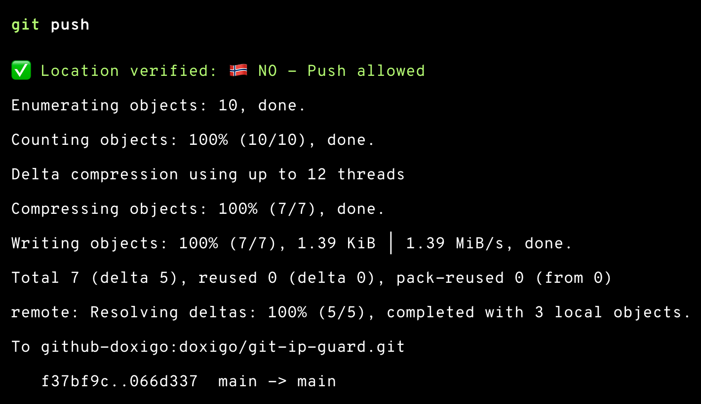
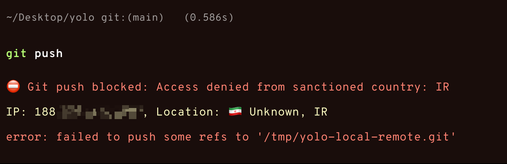
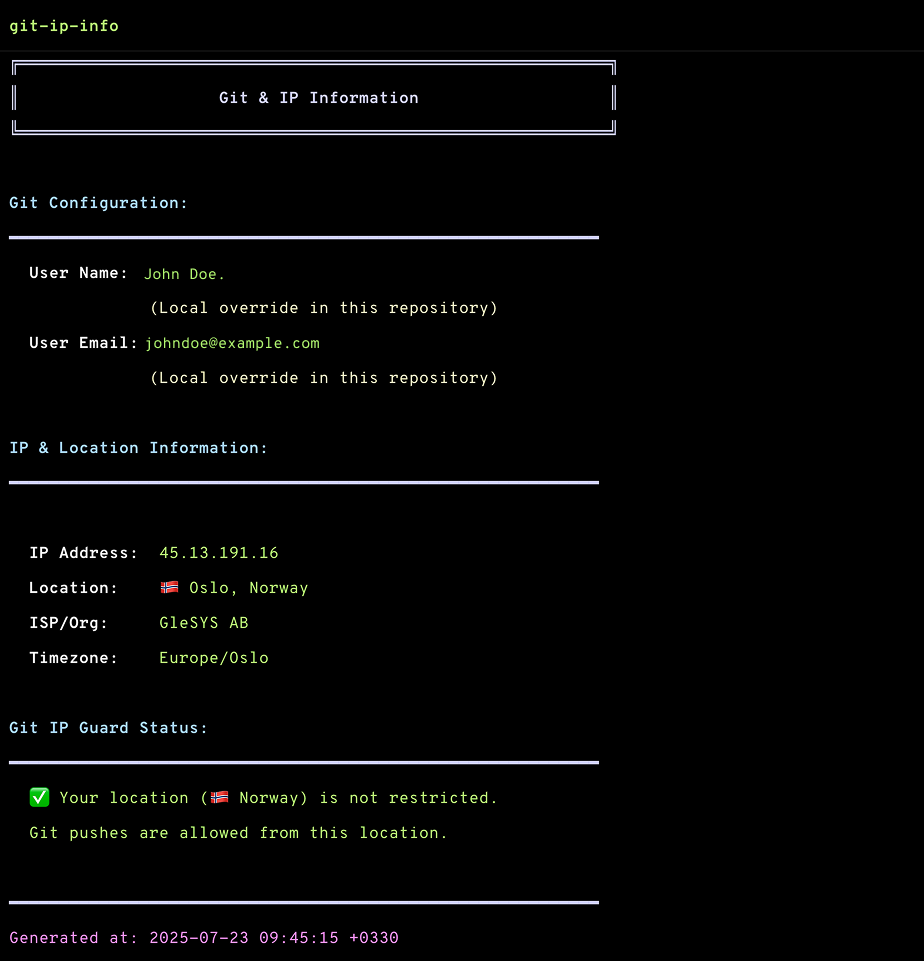

# Git IP Guard v2.0

A comprehensive security tool that prevents git pushes and pulls from sanctioned countries using git hooks, with granular control and management features.

## Context

There have been a lot of issues for developers living in sanctioned countries, which is quite unfortunate since they don't really have anything to do with the political side of things.

Git IP Guard v2.0 - a tool that enforces location-based restrictions on git operations (push and pull). While it's important to comply with regulations, it's equally important to remember that behind every blocked operation is a developer trying to contribute to open source, learn, or simply do their job.

The tool includes bypass mechanisms because sometimes compliance requirements conflict with humanitarian considerations. It's transparent about what it's doing (showing your location with country flags) and provides clear options for exceptions.

This isn't a celebration of restrictions, but rather a technical implementation of an unfortunate reality. I hope for a future where such tools become unnecessary and all developers can contribute freely regardless of their geography.

## Screenshots

### ✅ Push Allowed



### ⛔ Push Blocked



### 📊 Git IP Info Command



## Features

- 🛡️ Blocks git push and pull operations from sanctioned countries
- 📍 Automatic IP location detection with country flag display
- 🎨 Color-coded terminal prompts with clear feedback
- 🌍 Shows country flags for visual location confirmation (🇳🇴 🇺🇸 🇬🇧 etc.)
- ⚙️ Granular control over push/pull operations (global and repository-specific)
- 🔧 Easy installation, updates, and uninstallation
- 📦 Works with both new and existing repositories
- 🧪 Comprehensive test suite for all features
- 📊 `git-ip-info` command to check your IP and Git configuration
- 🎛️ `git-ip-control` command for easy management of all settings
- 🔄 Seamless updates that preserve existing configurations

## What's New in v2.0

🎆 **Major new features and improvements:**

- **🔒 Comprehensive Pull Protection**: Git pulls are now blocked from sanctioned countries in ALL scenarios:
  - **Merge pulls** via `pre-merge-commit` hook
  - **Rebase pulls** via `pre-rebase` hook  
  - **Fast-forward pulls** via wrapper script that intercepts all `git pull` commands
  - **Post-merge detection** via `post-merge` hook for additional security
- **⚙️ Granular Controls**: Enable/disable push and pull operations independently at global or repository level
- **🎛️ Management Utility**: New `git-ip-control` command for easy configuration management
- **🔄 Seamless Updates**: Automatic detection and migration of v1.0 configurations to v2.0
- **🧪 Enhanced Testing**: New test categories for pull protection and global controls
- **📊 Improved Status**: Comprehensive status reporting of all settings and installation state
- **🔧 Better Architecture**: Cleaner separation between operations with shared helper logic

**Backward Compatibility**: All existing v1.0 installations can be seamlessly upgraded without losing configuration.

## Requirements

- macOS with Homebrew
- Git
- Bash/Zsh shell
- `jq` (JSON processor)
- `curl` (for IP detection)

## Installation

### Quick Start

1. Clone this repository:

   ```bash
   git clone https://github.com/doxigo/git-ip-guard.git
   cd git-ip-guard
   ```

2. Install jq if not already installed:

   ```bash
   brew install jq
   ```

3. Run the installation script:

   ```bash
   chmod +x scripts/install.sh
   ./scripts/install.sh
   ```

   **For updates**: If you already have Git IP Guard installed, the script will automatically detect this and preserve your existing configuration while upgrading to v2.0.

4. **Optional**: Enable comprehensive fast-forward pull protection:

   ```bash
   # This sets up a wrapper that intercepts ALL git pull commands
   ./scripts/setup-fastforward-protection.sh
   ```
   
   This adds protection for fast-forward pulls that Git hooks cannot catch. After setup, **all** `git pull` commands will be checked, including fast-forward and "already up to date" scenarios.

5. For existing repositories, you have two options:

   **Option A**: Apply to individual repos

   ```bash
   cd /path/to/your/repo
   git init
   ```

   **Option B**: Bulk apply to multiple repos

   ```bash
   # Interactive mode - will prompt before overwriting existing hooks
   ./scripts/apply-to-existing-repos.sh

   # Force update mode - automatically overwrites existing hooks
   ./scripts/apply-to-existing-repos.sh --force
   ```

### Installation Options

```bash
# Basic installation (git hooks only)
./scripts/install.sh

# Install with system-wide helper (requires sudo)
./scripts/install.sh --install-helper
```

### Installing System-Wide Commands

#### git-ip-info Command

The `git-ip-info` command provides a quick way to check your current IP location and Git configuration:

```bash
# Install system-wide (requires sudo)
sudo cp scripts/git-ip-info /usr/local/bin/
sudo chmod +x /usr/local/bin/git-ip-info

# Now you can use it from anywhere
git-ip-info
```

#### git-ip-control Command

The `git-ip-control` command provides easy management of all Git IP Guard settings:

```bash
# Install system-wide (requires sudo)
sudo cp scripts/git-ip-control /usr/local/bin/
sudo chmod +x /usr/local/bin/git-ip-control

# Now you can use it from anywhere
git-ip-control status
git-ip-control disable --global --pull
git-ip-control enable --repo --push
```

## Uninstallation

To completely remove Git IP Guard:

```bash
chmod +x scripts/uninstall.sh
./scripts/uninstall.sh

```

## Usage

Once installed:

1. When you run `git push` or `git pull`, the system checks your IP location on-demand
2. Git operations will be blocked if you're in a sanctioned country
3. The hooks display your location with country flag for transparency
4. Use `git-ip-control status` to see all current settings and status

### Pull Protection User Experience

With comprehensive pull protection enabled, you'll see:

```bash
# Example pull with dual protection
$ git pull origin main
🔍 Checking IP location before pull...
✅ Location verified: 🇳🇴 NO - Pull allowed

✅ Location verified: 🇳🇴 NO - Pull allowed  # From Git hook
Updating a1b2c3d..e4f5g6h
Fast-forward
 README.md | 2 +-
 1 file changed, 1 insertion(+), 1 deletion(-)
```

The **dual protection** ensures IP checking works for:
- Fast-forward pulls (wrapper script)
- Already up-to-date scenarios (wrapper script)
- Merge commits (Git hooks)
- Rebase operations (Git hooks)

### Checking Your IP and Git Configuration

Use the `git-ip-info` command to quickly check your current IP location and Git configuration:

```bash
git-ip-info
```

This command displays:

- Your Git user name and email (both global and local if in a repository)
- Your current IP address and location with country flag
- ISP/Organization information
- Git IP Guard status (whether your location is restricted)
- Any active bypass settings


## Sanctioned Countries/Regions

Git operations (push and pull) are blocked from:

- 🇧🇾 Belarus (BY)
- 🇨🇺 Cuba (CU)
- 🇮🇷 Iran (IR)
- 🇰🇵 North Korea (KP)
- 🇷🇺 Russia (RU)
- 🇸🇾 Syria (SY)
- 🇺🇦 Specific regions of Ukraine:
  - Crimea
  - Donetsk Oblast
  - Luhansk Oblast

## Testing

Run the comprehensive test suite:

```bash
./test/test.sh          # Run all tests
./test/test.sh current  # Test current location only
./test/test.sh bypass   # Test bypass mechanisms
./test/test.sh pull     # Test pull protection
./test/test.sh global   # Test global enable/disable controls
./test/test.sh helper   # Test git-ip-check helper
```

The test will show:

- Your current location with country flag
- Whether pushes and pulls are allowed or blocked
- Verification of all bypass methods
- Global and repository-specific control functionality

To manually test with different locations:
1. Switch to a VPN location (try a sanctioned country like Russia)
2. Run the test script again

## How It Works

### Push Protection
1. When you run `git push`, the `pre-push` hook checks your IP location

### Pull Protection (Comprehensive Coverage)
Git IP Guard v2.0 provides layered pull protection covering all scenarios:

1. **Fast-forward pulls**: Wrapper script intercepts `git pull` commands **before** Git starts
2. **Merge pulls**: `pre-merge-commit` hook checks IP when Git creates merge commits  
3. **Rebase pulls**: `pre-rebase` hook checks IP during `git pull --rebase` operations
4. **Post-merge detection**: `post-merge` hook provides additional security layer

**Why layered protection?** Different pull scenarios trigger different Git hooks. The wrapper ensures **no pull operation** can bypass IP checking, regardless of Git's internal behavior.

### IP Detection Process
1. Uses `ifconfig.co` as primary service (more reliable, provides ISO country codes)
2. Automatically falls back to `ipinfo.io` if primary service is unavailable
3. Verifies if your country is in the sanctioned list
4. If not sanctioned, the operation proceeds normally with country flag display
5. If sanctioned, the operation is rejected with clear error message and location info
6. Special handling for Ukraine to check specific regions
7. Fails securely - blocks operation if location cannot be determined

## Control & Management

### Easy Management with git-ip-control

Git IP Guard v2.0 includes a comprehensive control utility:

```bash
# Check current status of all settings
./scripts/git-ip-control status

# Global controls
./scripts/git-ip-control disable --global          # Disable all operations globally
./scripts/git-ip-control enable --global           # Enable all operations globally
./scripts/git-ip-control disable --global --push   # Disable push operations globally
./scripts/git-ip-control disable --global --pull   # Disable pull operations globally

# Repository-specific controls
./scripts/git-ip-control disable --repo            # Disable all operations for current repo
./scripts/git-ip-control enable --repo --push      # Enable push operations for current repo
./scripts/git-ip-control disable --repo --pull     # Disable pull operations for current repo

# Update existing installation
./scripts/git-ip-control update
```

## Disabling/Bypassing IP Checks

There are several methods to disable or bypass the IP check mechanism:

### 1. Temporary Bypass (Environment Variable)

- Usage: `IPCHECK_BYPASS=1 git push origin main` or `IPCHECK_BYPASS=1 git pull origin main`
- Scope: Single command only
- Use case: Emergency operations, false positives

### 2. Repository-Specific Controls

```bash
# Disable all operations for current repository
git config ipcheck.disable true

# Disable only push operations
git config ipcheck.push.disable true

# Disable only pull operations
git config ipcheck.pull.disable true

# Re-enable (remove disable setting)
git config --unset ipcheck.disable
git config --unset ipcheck.push.disable
git config --unset ipcheck.pull.disable
```

### 3. Global Controls

```bash
# Disable all operations globally
git config --global ipcheck.global.disable true

# Disable only push operations globally
git config --global ipcheck.push.disable true

# Disable only pull operations globally
git config --global ipcheck.pull.disable true

# Re-enable (remove disable setting)
git config --global --unset ipcheck.global.disable
git config --global --unset ipcheck.push.disable
git config --global --unset ipcheck.pull.disable
```

### 4. Complete Removal

```bash
chmod +x scripts/uninstall.sh
./scripts/uninstall.sh
```

### Implementation Details

Both hooks (`pre-push` and `pre-merge-commit`) include comprehensive bypass checks:

```bash
# Check for temporary bypass via environment variable
if [ "$IPCHECK_BYPASS" = "1" ]; then
  echo -e "${YELLOW}⚠️  IP check bypassed via IPCHECK_BYPASS environment variable${NC}"
  exit 0
fi

# Check for global disable via git config
if [ "$(git config --global --get ipcheck.global.disable)" = "true" ]; then
  echo -e "${YELLOW}⚠️  IP check globally disabled${NC}"
  exit 0
fi

# Check for operation-specific global disable
if [ "$(git config --global --get ipcheck.push.disable)" = "true" ]; then
  echo -e "${YELLOW}⚠️  IP check disabled globally for push operations${NC}"
  exit 0
fi

# Check for repo-local disable via git config
if [ "$(git config --get ipcheck.disable)" = "true" ]; then
  echo -e "${YELLOW}⚠️  IP check disabled for this repository${NC}"
  exit 0
fi
```

### Testing Bypass Mechanisms

The test suite includes comprehensive bypass testing:
- `./test/test.sh bypass` - Tests all bypass mechanisms for push and pull
- `./test/test.sh global` - Tests global enable/disable functionality
- `./test/test.sh pull` - Tests pull-specific protection and bypasses

The tests verify:
- Environment variable bypass (IPCHECK_BYPASS=1)
- Repository-specific disable for all operations, push-only, and pull-only
- Global disable for all operations, push-only, and pull-only
- Re-enabling checks at all levels
- git-ip-control command functionality

## Troubleshooting

### Upgrading from v1.0

If upgrading from Git IP Guard v1.0:

1. Simply run `./scripts/install.sh` - it will detect and update automatically
2. Your existing configuration will be preserved and migrated to v2.0 format
3. Pull protection will be automatically enabled
4. Use `./scripts/git-ip-control status` to see the new capabilities

### "IP cache file not found" error

If you see this error after updating Git IP Guard:

- You have an outdated `git-ip-check` helper installed
- Solution: Run `./scripts/git-ip-control update` or `./scripts/install.sh --install-helper`
- Alternative: Remove it with `sudo rm /usr/local/bin/git-ip-check`

### Connection or IP detection errors

- Check your internet connection
- Try the operation again (the hook includes automatic retry logic)
- Use `IPCHECK_BYPASS=1 git push` or `IPCHECK_BYPASS=1 git pull` for temporary bypass

### Hook not triggering

- For new repos: Hooks are automatically installed via git templates
- For existing repos: Run `git init` in the repository to apply the template
- **Important**: All these files must be present in `.git/hooks/`:
  - `pre-push` (push protection)
  - `pre-merge-commit` (pull merge protection)
  - `pre-rebase` (pull rebase protection)
  - `post-merge` (fast-forward detection)
  - `ip-check-config.json` (configuration)
- If hooks are missing, use `./scripts/apply-to-existing-repos.sh --force`
- For fast-forward pull protection: Run `./scripts/setup-fastforward-protection.sh`
- Use `./scripts/git-ip-control status` to check installation status

### False positives with VPN

If you're using a VPN, the detected country will be the VPN server's location, not your actual location. You can use the temporary bypass method described above.

## Security Considerations

- This is a client-side check and can be bypassed by modifying the hook
- For server-side enforcement, implement similar checks in your Git server
- The hook uses ifconfig.co as primary service with automatic fallback to ipinfo.io
- IP detection services have rate limits for free usage, but the helper includes retry logic
- **Important**: The system fails securely - if IP location cannot be determined (e.g., due to service blocking certain countries), git operations are blocked for security reasons
- The system shows country flags and location details for better user feedback

## Contributing

Pull requests are welcome! Please feel free to submit improvements.

## Advanced Features

### Comprehensive Pull Protection

Git IP Guard v2.0 includes the most comprehensive pull protection available:

#### Standard Hook Protection
- `pre-merge-commit`: Protects pull operations that create merge commits
- `pre-rebase`: Protects `git pull --rebase` operations
- `post-merge`: Detects and warns about fast-forward pulls (post-operation)

#### Fast-Forward Pull Protection
Fast-forward pulls don't trigger standard Git hooks, so Git IP Guard includes a wrapper system:

```bash
# Setup comprehensive protection (optional but recommended)
./scripts/setup-fastforward-protection.sh
```

This creates:
1. **Git alias**: `git pull-guarded` for manual use
2. **Shell wrapper**: Intercepts ALL `git pull` commands automatically
3. **System-wide installation**: Works in any repository

**Usage after setup**:
```bash
# All these are now protected:
git pull                    # Intercepted by wrapper
git pull origin main        # Intercepted by wrapper  
git pull --rebase          # Wrapper + pre-rebase hook
git pull-guarded           # Manual alias usage
git-pull-original          # Bypass to original git pull
```

**Benefits**:
- Protects fast-forward pulls that hooks cannot catch
- Protects "already up to date" scenarios
- Provides consistent user experience
- Multiple layers of security

### Rate Limit Handling

The git-ip-check helper includes automatic fallback to alternative IP services:

1. Primary: `ifconfig.co/json` (provides ISO country codes, more reliable)
2. Fallback: `ipinfo.io/json` (automatic switch when primary is unavailable)
3. Retry logic with delays
4. Country flag display for visual feedback (🇳🇴, 🇺🇸, 🇬🇧, etc.)
5. Handles both ISO codes and full country names

This ensures the IP check continues working even during rate limiting.

### Reusable Helper Scripts

#### git-ip-check

The `git-ip-check` script can be installed system-wide for use in multiple hooks:

```bash
# Install to /usr/local/bin (requires sudo)
./scripts/install.sh --install-helper

# Use in any git hook with operation type
git-ip-check "/config/ip-check-config.json" push
git-ip-check "/config/ip-check-config.json" pull

# With custom bypass variables
git-ip-check "/path/to/config.json" push IPCHECK_BYPASS ipcheck.disable
```

#### git-ip-info

The `git-ip-info` command provides detailed information about your current IP location and Git configuration:

```bash
# Check your IP and Git info from anywhere
git-ip-info
```

Features:

- Displays current IP address with country flag
- Shows Git user name and email configuration
- Indicates if you're in a git repository with local overrides
- Warns if your location is in the sanctioned list
- Shows ISP/Organization and timezone information
- Checks for active IP check bypasses

#### git-ip-control

The `git-ip-control` command provides comprehensive management of Git IP Guard:

```bash
# Install system-wide (optional)
sudo cp scripts/git-ip-control /usr/local/bin/
sudo chmod +x /usr/local/bin/git-ip-control

# Check status from anywhere
git-ip-control status

# Manage settings easily
git-ip-control disable --global --pull
git-ip-control enable --repo --push
git-ip-control update
```

Features:
- Complete status overview of all settings
- Global and repository-specific controls
- Operation-specific management (push/pull)
- Easy update mechanism
- Installation status checking

### Using in Other Hooks

Example pre-commit hook:

```bash
#!/bin/bash
git-ip-check "$(dirname "$0")/ip-check-config.json" \
  "commit" \
  "COMMIT_IPCHECK_BYPASS" \
  "ipcheck.disable.commit"
```

This allows you to:

- Use different bypass mechanisms for different hooks
- Share the same IP checking logic across multiple git operations
- Maintain consistent security policies

### Bulk Apply to Existing Repositories

The `apply-to-existing-repos.sh` script helps you apply Git IP Guard to multiple existing repositories:

**Interactive mode** (recommended):

```bash
./apply-to-existing-repos.sh
```

This will prompt you to:

1. Search common development directories
2. Search from current directory
3. Specify a custom directory

**Command line mode**:

```bash
# Apply to specific directories
./apply-to-existing-repos.sh ~/Projects ~/Work

# Apply to all repos under current directory
./apply-to-existing-repos.sh .
```

**Force update mode** (skip confirmation prompts):

```bash
# Force update in interactive mode
./apply-to-existing-repos.sh --force

# Force update specific directories
./apply-to-existing-repos.sh -f ~/Projects ~/Work
```

The script:

- Finds all Git repositories in specified directories
- Asks before overwriting existing hooks (unless `--force` is used)
- Uses `git init` to properly apply the template
- Shows progress and summary
- Supports `--help` flag for usage information

## Future Improvements

### Country List Management

The allowed/blocked country lists can be managed via:

1. Direct editing of `ip-check-config.json`

### Integration with CI/CD

The git-ip-check helper can be integrated into CI/CD pipelines:

```bash
# In your CI script
if git-ip-check "/path/to/ci-config.json"; then
    echo "Location check passed"
else
    echo "Build blocked due to location restrictions"
    exit 1
fi
```

## License

MIT License - feel free to use this in your projects!
